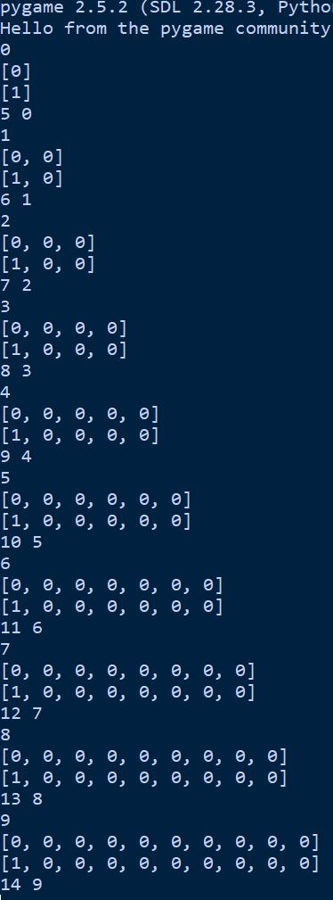

# Prisoner's Dilemma Simulator

This project is a simple simulator of the Prisoner's Dilemma game using Pygame. The game demonstrates the decision-making process between two players (Player 1 and Player 2) in a classic dilemma scenario where they must choose whether to cooperate or compete.

## Usage
- The simulator starts with both players making decisions in each round.
- Player 1 always competes (chooses 0), while Player 2's strategy is to cooperate (1) in the first round. After the first round, Player 2 bases its decision on Player 1's previous choice.
- The game continues for a predefined number of rounds (10 by default).
- The decisions and scores are printed to the console at each step.

# Game Mechanics
### Players' Choices:

0: Compete (Red)
1: Cooperate (Green)
### Scoring:

If both players cooperate (1), both receive 3 points.
If one cooperates (1) and the other competes (0), the competitor receives 5 points, and the cooperator receives 0.
If both compete (0), both receive 1 point.
### Gameplay Loop:

The game runs for 10 rounds by default, during which each player's decisions and scores are calculated and displayed.
The game window is filled with a black background, and the round continues until the specified number of rounds is completed or the user closes the window.

## Customization
- Change Rounds: Modify the rounds variable.
- Update Strategies: Edit the p1_choise() and p2_choise() functions.

## Game Output

Each round of the game provides the following:

- **Round Number**: The current round (variable `runs`).

- **Player 1 Decisions**: List of choices made by Player 1 (0 = not cooperating, 1 = cooperating).
  
- **Player 2 Decisions**: List of choices made by Player 2 (0 = not cooperating, 1 = cooperating).

- **Scores**: 
  - Player 1's total score.
  - Player 2's total score.

